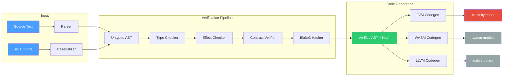
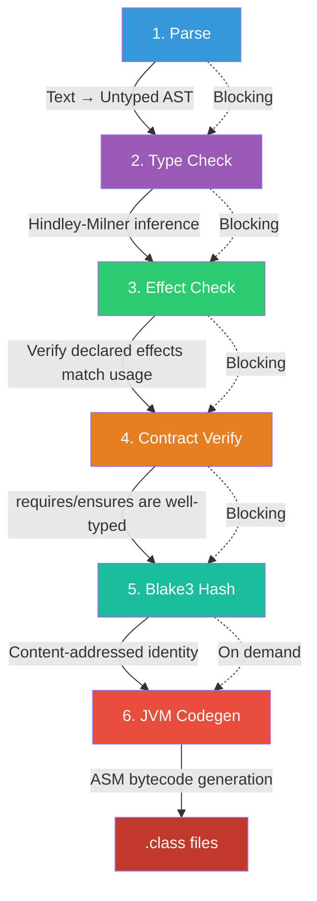
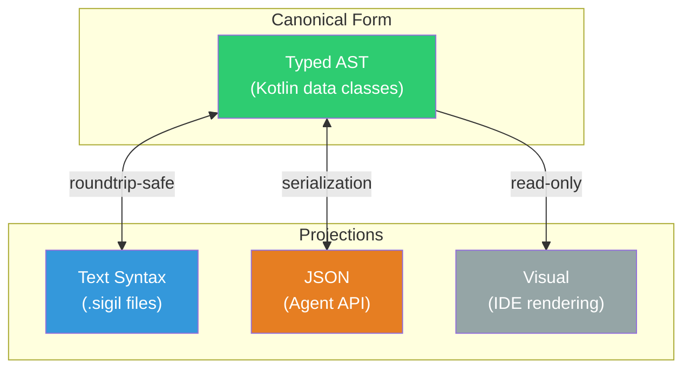
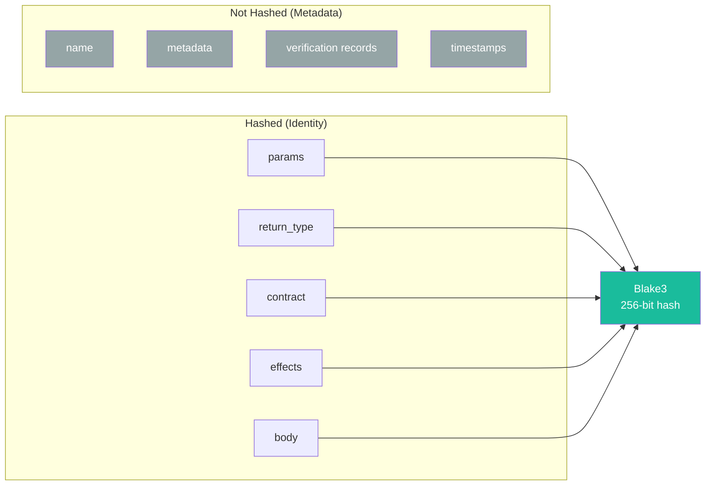
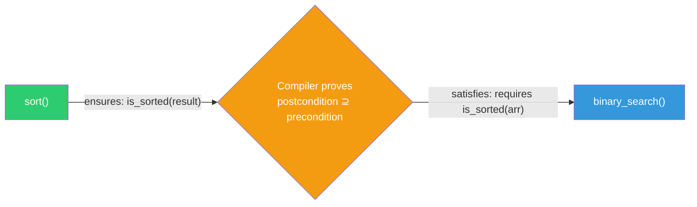
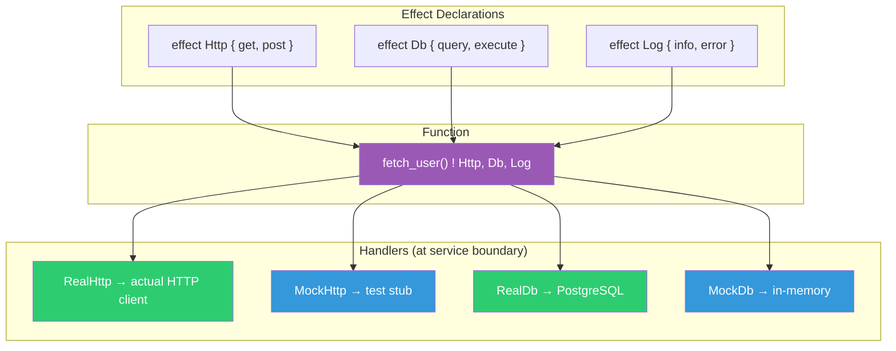
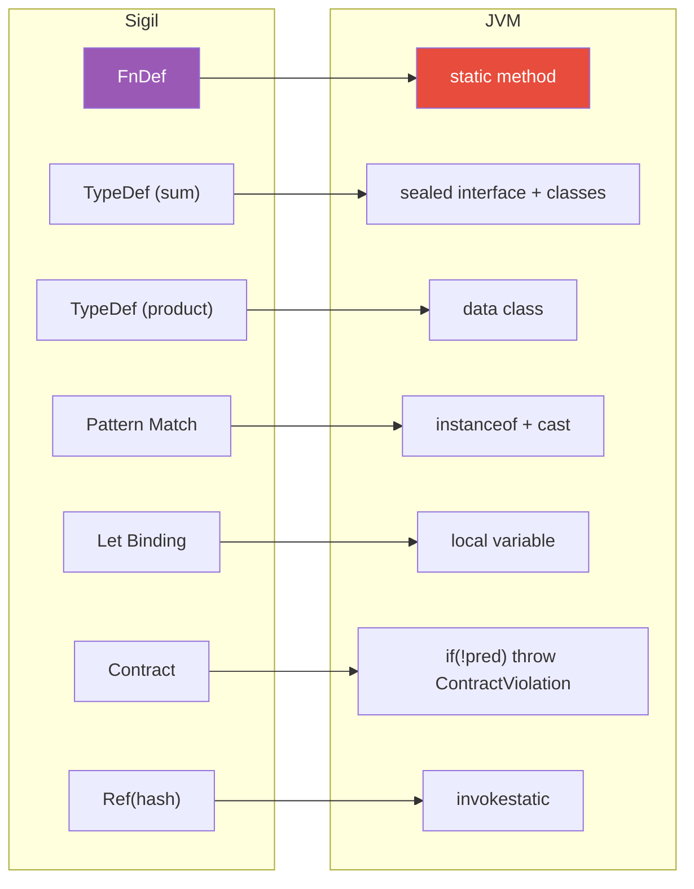
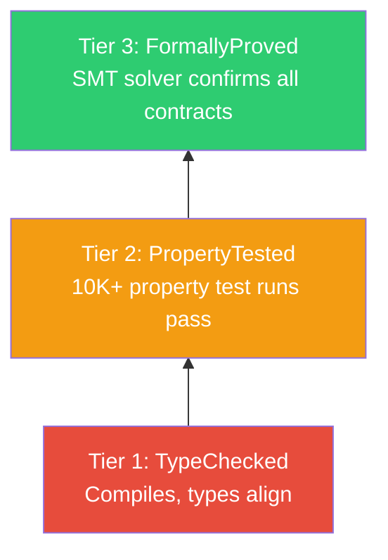
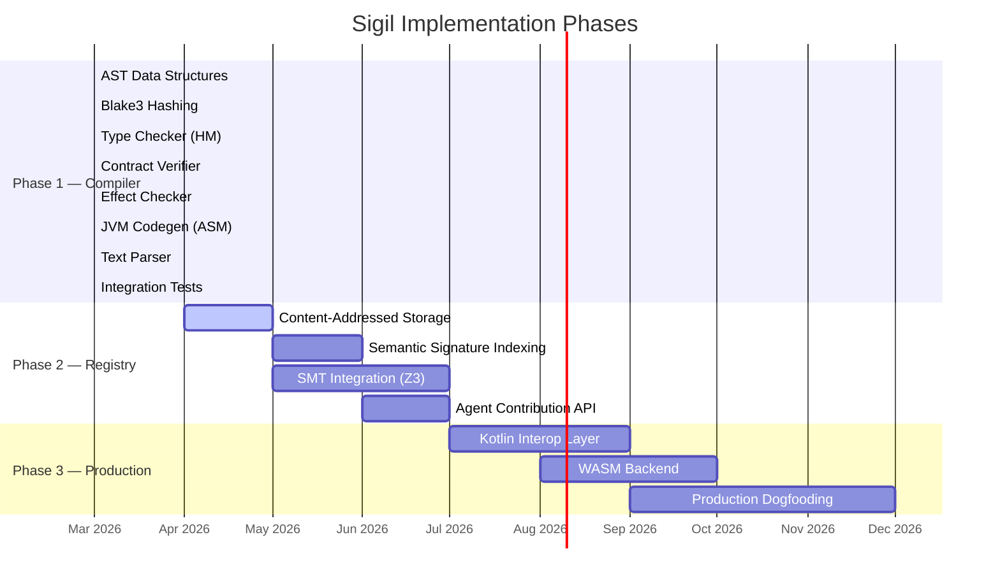

# Sigil

**An AST-native, content-addressed, agent-authored programming language with verified capabilities, algebraic effects, and a knowledge-sharing registry.**

Sigil is a programming language designed from first principles for a world where AI agents are the primary authors of code. Unlike existing languages — designed for humans to express intent to machines — Sigil treats agents as first-class writers and humans as consumers of verified, composable capabilities.

```
fn sort<T: Comparable>(arr: List<T>) -> List<T>
  ensures is_sorted(result)
  ensures same_elements(result, arr)
{
  match arr {
    []  => [],
    [x] => [x],
    _   => {
      let pivot = arr[0]
      let less = arr.filter(|x| x < pivot)
      let equal = arr.filter(|x| x == pivot)
      let greater = arr.filter(|x| x > pivot)
      sort(less) ++ equal ++ sort(greater)
    }
  }
}
```

---

## Why Sigil?

Agent-generated code is exploding, but there is no coordination layer for it. Every agent session starts from scratch. The knowledge an agent discovers while solving one problem is lost when the session ends.

Sigil fixes this by making the language itself a knowledge-sharing system.

| Problem | How Sigil Solves It |
|---|---|
| Agents duplicate work across sessions | Content-addressed identity — identical functions hash to the same value globally |
| No trust between agent-authored components | Contracts (`requires`/`ensures`) are part of the hash, verified at compile time |
| Hidden side effects cause composition bugs | Algebraic effect system — every side effect is declared and tracked |
| Code rots as runtimes change | Target-agnostic AST is the canonical form; JVM/WASM/LLVM are pluggable backends |
| Naming conflicts across agents | Names are aliases — identity is structural, not nominal |

---

## Architecture



> **Phase 1 (this repo)** implements the full pipeline from source text through JVM bytecode generation. WASM and LLVM backends are planned for future phases.

---

## Compiler Pipeline

Every Sigil program passes through a six-stage verification pipeline before code generation:



| Stage | Component | Input | Output |
|---|---|---|---|
| Parse | `SigilParser` | Source text or JSON | Untyped AST |
| Type Check | `TypeChecker` (Algorithm W) | Untyped AST | Typed AST |
| Effect Check | `EffectChecker` | Typed AST | Effect-verified AST |
| Contract Verify | `ContractVerifier` | Typed AST | Contract-verified AST |
| Hash | `Blake3` + `Hasher` | Verified AST | Content hash (256-bit) |
| Codegen | `JvmCodegen` (ASM) | Verified AST | `.class` bytecode |

---

## Core Concepts

### AST-Native

The canonical representation of Sigil code is a typed, verified Abstract Syntax Tree — not text. Text files are a *projection* (a rendering format for human consumption). Agents author AST nodes directly via the programmatic API.



### Content-Addressed Identity

Every definition is identified by the Blake3 hash of its structural content. Names are just aliases.

```kotlin
// Two agents independently write the same function:

// Agent A calls it "quicksort"
fn quicksort(arr: List<Int>) -> List<Int> { /* ... */ }

// Agent B calls it "sort_fast"
fn sort_fast(arr: List<Int>) -> List<Int> { /* identical body */ }

// Both produce the SAME hash: a7f3b2e...
// Names are excluded from the hash. Structure IS identity.
```

**What goes into the hash:**



### Contract System

Contracts (`requires`/`ensures`) are not optional annotations — they are part of the function's hash and identity. The compiler uses them to prove composition safety.

```
fn binary_search(arr: List<Int>, target: Int) -> Option<Int>
  requires is_sorted(arr)
  requires arr.length > 0
  ensures match result {
    Some(i) => arr[i] == target,
    None => true
  }
```

**Contract chaining** is the key composition mechanism:



When `sort`'s ensures clause (`is_sorted(result)`) satisfies `binary_search`'s requires clause (`is_sorted(arr)`), the compiler can prove the composition is safe — no runtime check needed at the boundary.

### Effect System

Every side effect must be declared in the function signature. Pure functions are the default.

```
// The ! declares which effects this function performs
fn fetch_user(id: UserId) -> Result<User, Error> ! Http, Db, Log {
  Log.info("Fetching user")
  let row = Db.query("SELECT * FROM users WHERE id = ?", [id])
  match row {
    [r] => Ok(User.from_row(r)),
    []  => Err(Error.NotFound),
    _   => Err(Error.Ambiguous)
  }
}
```



Effects propagate through the call graph. If function A calls function B which has `Http`, then A also has `Http` unless it handles it with an effect handler.

---

## AST Node Hierarchy


---

## Language Syntax

Sigil uses 15 keywords and a syntax inspired by Rust/Kotlin/ML:

```
fn  type  trait  effect  module  export  handler
let  match  if  then  else  requires  ensures  property
```

### Functions

```
fn add(a: Int, b: Int) -> Int { a + b }

fn max(a: Int, b: Int) -> Int {
  if a > b then a else b
}
```

### Algebraic Data Types

```
type State {
  | Idle
  | Processing(item: String)
  | Complete(result: String)
  | Failed(error: String)
}

type Pair<A, B> {
  | Pair(first: A, second: B)
}
```

### Pattern Matching

```
fn transition(state: State, event: Event) -> State {
  match (state, event) {
    (Idle, Start(item))        => Processing(item),
    (Processing(_), Finish(r)) => Complete(r),
    (Processing(_), Error(msg)) => Failed(msg),
    (Complete(_), Reset)       => Idle,
    (Failed(_), Reset)         => Idle,
    (s, _)                     => s
  }
}
```

### Effects

```
effect Http {
  get(url: String) -> String
  post(url: String, body: String) -> String
}

fn fetchData(url: String) -> String ! Http {
  Http.get(url)
}

handler MockHttp for Http {
  get = |url| "mock response"
  post = |url, body| "mock post"
}
```

### Traits

```
trait Monoid<T> {
  fn combine(a: T, b: T) -> T
  fn empty() -> T

  property forall (a: T) => combine(a, empty()) == a
  property forall (a: T) => combine(empty(), a) == a
}
```

---

## Type System

- **Structural typing** with **Hindley-Milner inference** — types are identified by structure, not name
- **Refinement types** — base types narrowed by predicates (`Refine Int where |self| self > 0`)
- **Trait-based polymorphism** — content-addressed trait definitions
- **Generic type parameters** with bounds (`T: Comparable`)

### Primitive Types

| Type | Hash Prefix | JVM Mapping |
|---|---|---|
| `Int` | `#sigil:int` | `long` |
| `Int32` | `#sigil:i32` | `int` |
| `Int64` | `#sigil:i64` | `long` |
| `Float64` | `#sigil:f64` | `double` |
| `Bool` | `#sigil:bool` | `boolean` |
| `String` | `#sigil:string` | `java.lang.String` |
| `Unit` | `#sigil:unit` | `void` |
| `List<T>` | `#sigil:list` | `java.util.List` |
| `Map<K, V>` | `#sigil:map` | `java.util.Map` |
| `Option<T>` | `#sigil:option` | nullable / sealed class |
| `Result<T, E>` | `#sigil:result` | sealed class |

---

## JVM Code Generation

Sigil compiles to JVM bytecode via the ASM library. Compiled functions are directly callable from Kotlin/Java.



### Calling Compiled Sigil from Kotlin

```kotlin
// Compile a Sigil function
val compiler = SigilCompiler()
val result = compiler.compileSource("fn square(x: Int) -> Int { x * x }")

// Load and call it
val clazz = result.classLoader.loadClass(result.functions[0].className)
val method = clazz.getMethod("square", Long::class.java)
val answer = method.invoke(null, 7L)  // Returns 49L
```

---

## Getting Started

### Prerequisites

- **JDK 21+** (tested with OpenJDK 23)
- **Gradle** (wrapper included)

### Build

```bash
cd compiler
./gradlew build
```

### Run Tests

```bash
./gradlew test
```

**104 tests** across 8 test suites:

| Suite | Tests | Coverage |
|---|---|---|
| `TypeCheckerTest` | 29 | HM inference, pattern matching, generics, error cases |
| `ParserTest` | 24 | Lexer, all grammar constructs, spec examples |
| `IntegrationTest` | 13 | Full end-to-end pipeline: parse → check → hash → compile → execute |
| `JvmCodegenTest` | 9 | Bytecode generation, arithmetic, control flow, contracts |
| `ContractVerifierTest` | 9 | requires/ensures, contract chaining, severity levels |
| `Blake3Test` | 8 | Hash correctness, known test vectors, determinism |
| `HasherTest` | 6 | Canonical serialization, name-independence, stability |
| `EffectCheckerTest` | 6 | Effect tracking, propagation, handler removal |

### Use as a Library

```kotlin
import sigil.api.SigilCompiler

val compiler = SigilCompiler()

// Option 1: Compile from source text
val result = compiler.compileSource("""
    fn add(a: Int, b: Int) -> Int { a + b }
""")

// Option 2: Compile from AST (for agent use)
import sigil.ast.*

val fn = FnDef(
    name = "add",
    params = listOf(
        Param("a", TypeRef(PrimitiveTypes.INT)),
        Param("b", TypeRef(PrimitiveTypes.INT))
    ),
    returnType = TypeRef(PrimitiveTypes.INT),
    body = ExprNode.Apply(
        fn = ExprNode.Ref("#sigil:add"),
        args = listOf(ExprNode.Ref("a"), ExprNode.Ref("b"))
    )
)

val compiled = compiler.compileFn(fn)
println("Hash: ${compiled.hash}")
println("Class: ${compiled.className}")
```

---

## Project Structure

```
sigil/
  compiler/                          # Kotlin/Gradle project
    src/main/kotlin/sigil/
      ast/                           # AST node data classes (12 files)
        ExprNode.kt                  #   Expression nodes (sealed class, 8 variants)
        FnDef.kt                     #   Function definition
        TypeDef.kt                   #   Algebraic data types
        ContractNode.kt              #   requires/ensures contracts
        EffectDef.kt                 #   Effect declarations
        TraitDef.kt                  #   Trait definitions
        ModuleDef.kt                 #   Module definitions
        TypeRef.kt                   #   Type references & type variables
        RefinementType.kt            #   Refinement types
        EffectHandler.kt             #   Effect handler implementations
        Types.kt                     #   Primitive type constants
        Metadata.kt                  #   SemanticMeta, VerificationRecord
      hash/                          # Content-addressing
        Blake3.kt                    #   Pure Kotlin Blake3 implementation
        Hasher.kt                    #   Canonical AST serialization
      types/                         # Type system
        TypeChecker.kt               #   Hindley-Milner type inference
        Unifier.kt                   #   Constraint unification (Algorithm W)
        TraitResolver.kt             #   Trait bound checking
      contracts/                     # Contract system
        ContractVerifier.kt          #   Contract validation + chaining
        PropertyTester.kt            #   Property-based testing (QuickCheck-style)
      effects/                       # Effect system
        EffectChecker.kt             #   Effect tracking + propagation
      codegen/jvm/                   # JVM backend
        JvmCodegen.kt               #   ASM bytecode generation
        JvmLinker.kt                 #   ClassLoader for compiled code
        LocalVarTable.kt             #   Local variable index tracking
        ContractViolation.kt         #   Runtime exception for contract failures
      parser/                        # Text syntax
        SigilLexer.kt               #   Tokenizer
        SigilParser.kt              #   Recursive descent parser
      api/                           # Entry points
        SigilCompiler.kt            #   Unified compilation pipeline
        Main.kt                     #   CLI entry point
    src/test/kotlin/sigil/           # Test suites (104 tests)
```

---

## Verification Tiers

Every compiled node receives a verification tier that represents the level of trust:



| Tier | Name | Requirement | Status |
|---|---|---|---|
| 1 | TypeChecked | Compiles, types align | Implemented |
| 2 | PropertyTested | 10K+ property-based test runs pass | Basic framework |
| 3 | FormallyProved | SMT solver confirms all contracts | Planned (Phase 2) |

---

## Roadmap



### What's Implemented (Phase 1)

- Full AST node type system with `@Serializable` annotations
- Pure Kotlin Blake3 implementation (256-bit, deterministic)
- Canonical AST serialization for content-addressing
- Hindley-Milner type inference (Algorithm W)
- Algebraic effect system with propagation
- Contract verification with chaining detection
- JVM bytecode generation (arithmetic, control flow, pattern matching, contracts)
- Recursive descent parser for the full text syntax
- Unified `SigilCompiler` pipeline API

### What's Planned

- **Phase 2:** Knowledge-sharing registry with semantic search, MongoDB storage, SMT-backed formal proofs
- **Phase 3:** Kotlin FFI, WASM/LLVM backends, production deployment in backend services

---

## Design Principles

1. **AST-native, not text-native.** The canonical representation is a typed AST. Text is a rendering.
2. **Content-addressed identity.** Structure is identity. Names are aliases. No naming conflicts.
3. **Verification as a first-class layer.** Contracts are part of the hash. Unverified code cannot enter the registry.
4. **Effects are declared, not hidden.** Every side effect must be in the function signature.
5. **Target-agnostic persistence.** The verified AST is permanent. Compilation targets are pluggable.
6. **Agent-first ergonomics.** Designed for what agents need: structural clarity, unambiguous semantics, rich metadata.

---

## Contributing

Sigil is designed to be built *by* agents, *for* agents. The agent contribution protocol is:

1. Construct an AST node (as JSON or Kotlin objects)
2. Submit to the verification pipeline
3. Type checker, effect checker, and contract verifier run
4. If all pass: Blake3 hash is computed, node is stored
5. Property-based testing runs asynchronously (Tier 2 upgrade)
6. SMT solver runs asynchronously (Tier 3 upgrade)

---

## License

MIT
