# Sigil

**An AST-native, content-addressed, agent-authored programming language with verified capabilities, algebraic effects, and a knowledge-sharing registry.**

Sigil is a programming language designed from first principles for a world where AI agents are the primary authors of code. Unlike existing languages — designed for humans to express intent to machines — Sigil treats agents as first-class writers and humans as consumers of verified, composable capabilities.

```
fn sort<T: Comparable>(arr: List<T>) -> List<T>
  ensures is_sorted(result)
  ensures same_elements(result, arr)
{
  match arr {
    []  => [],
    [x] => [x],
    _   => {
      let pivot = arr[0]
      let less = arr.filter(|x| x < pivot)
      let equal = arr.filter(|x| x == pivot)
      let greater = arr.filter(|x| x > pivot)
      sort(less) ++ equal ++ sort(greater)
    }
  }
}
```

---

## Why Sigil?

Agent-generated code is exploding, but there is no coordination layer for it. Every agent session starts from scratch. The knowledge an agent discovers while solving one problem is lost when the session ends.

Sigil fixes this by making the language itself a knowledge-sharing system.

| Problem | How Sigil Solves It |
|---|---|
| Agents duplicate work across sessions | Content-addressed identity — identical functions hash to the same value globally |
| No trust between agent-authored components | Contracts (`requires`/`ensures`) are part of the hash, verified at compile time |
| Hidden side effects cause composition bugs | Algebraic effect system — every side effect is declared and tracked |
| Code rots as runtimes change | Target-agnostic AST is the canonical form; JVM/WASM/LLVM are pluggable backends |
| Naming conflicts across agents | Names are aliases — identity is structural, not nominal |
| No way to find reusable components | Registry with semantic search by type signature, effects, and contracts |

---

## Architecture

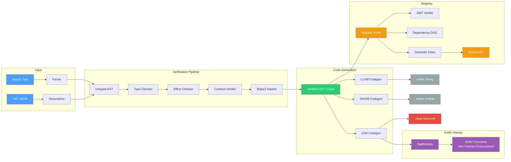

> **Phase 1** implements the full compiler pipeline from source text through JVM bytecode generation. **Phase 2** adds the knowledge-sharing registry with semantic search, dependency tracking, SMT verification, and an HTTP API. **Phase 3** adds Kotlin interop, a CLI, performance benchmarks, and dogfooding examples. WASM and LLVM backends are planned for future work.

---

## Quick Start

```bash
# Build everything
./gradlew build

# Run all 262 tests
./gradlew test

# Compile and run a Sigil program
./gradlew :compiler:run --args="run example.sigil add 3 4"

# Start the registry server
./gradlew :registry:run

# Run the dogfooding demo
./gradlew :examples:run
```

### Calling Sigil from Kotlin

```kotlin
import sigil.interop.SigilModule

// Compile Sigil source and call functions from Kotlin
val module = SigilModule.compile("""
    fn clamp(x: Int, lo: Int, hi: Int) -> Int {
        requires lo <= hi
        ensures result >= lo
        ensures result <= hi
        if x < lo then lo else if x > hi then hi else x
    }
""")

val result = module.call<Long>("clamp", 150L, 0L, 100L)  // returns 100L

// List available functions
module.listFunctions().forEach { fn ->
    println("${fn.name}: (${fn.paramTypes.joinToString()}) -> ${fn.returnType}")
}
```

---

## Compiler Pipeline

Every Sigil program passes through a six-stage verification pipeline before code generation:

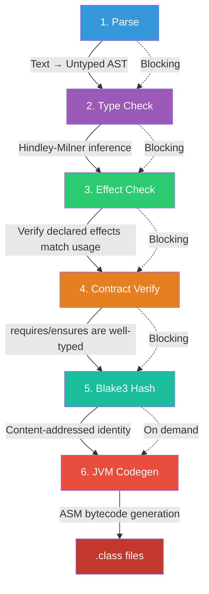

| Stage | Component | Input | Output |
|---|---|---|---|
| Parse | `SigilParser` | Source text or JSON | Untyped AST |
| Type Check | `TypeChecker` (Algorithm W) | Untyped AST | Typed AST |
| Effect Check | `EffectChecker` | Typed AST | Effect-verified AST |
| Contract Verify | `ContractVerifier` | Typed AST | Contract-verified AST |
| Hash | `Blake3` + `Hasher` | Verified AST | Content hash (256-bit) |
| Codegen | `JvmCodegen` (ASM) | Verified AST | `.class` bytecode |

---

## Core Concepts

### AST-Native

The canonical representation of Sigil code is a typed, verified Abstract Syntax Tree — not text. Text files are a *projection* (a rendering format for human consumption). Agents author AST nodes directly via the programmatic API.

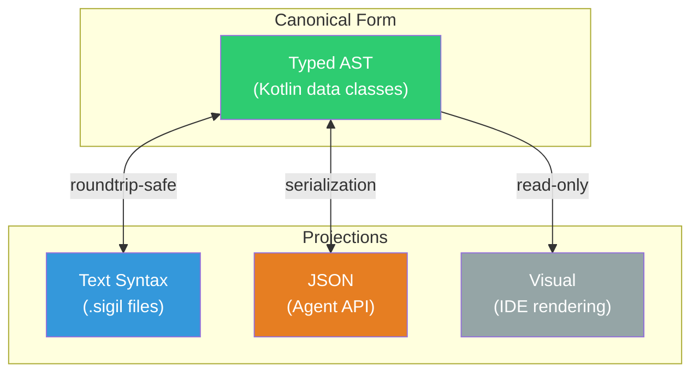

### Content-Addressed Identity

Every definition is identified by the Blake3 hash of its structural content. Names are just aliases.

```kotlin
// Two agents independently write the same function:

// Agent A calls it "quicksort"
fn quicksort(arr: List<Int>) -> List<Int> { /* ... */ }

// Agent B calls it "sort_fast"
fn sort_fast(arr: List<Int>) -> List<Int> { /* identical body */ }

// Both produce the SAME hash: a7f3b2e...
// Names are excluded from the hash. Structure IS identity.
```

**What goes into the hash:**

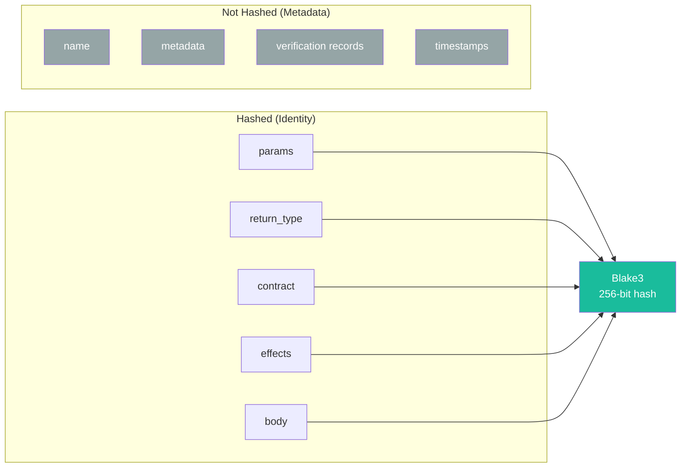

### Contract System

Contracts (`requires`/`ensures`) are not optional annotations — they are part of the function's hash and identity. The compiler uses them to prove composition safety.

```
fn binary_search(arr: List<Int>, target: Int) -> Option<Int>
  requires is_sorted(arr)
  requires arr.length > 0
  ensures match result {
    Some(i) => arr[i] == target,
    None => true
  }
```

**Contract chaining** is the key composition mechanism:

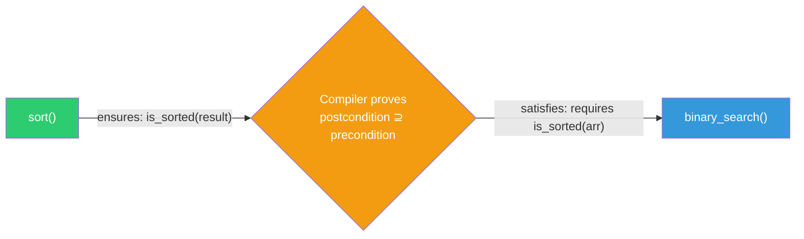

When `sort`'s ensures clause (`is_sorted(result)`) satisfies `binary_search`'s requires clause (`is_sorted(arr)`), the compiler can prove the composition is safe — no runtime check needed at the boundary.

### Effect System

Every side effect must be declared in the function signature. Pure functions are the default.

```
// The ! declares which effects this function performs
fn fetch_user(id: UserId) -> Result<User, Error> ! Http, Db, Log {
  Log.info("Fetching user")
  let row = Db.query("SELECT * FROM users WHERE id = ?", [id])
  match row {
    [r] => Ok(User.from_row(r)),
    []  => Err(Error.NotFound),
    _   => Err(Error.Ambiguous)
  }
}
```

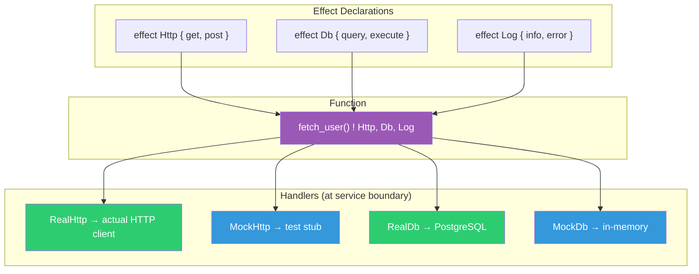

Effects propagate through the call graph. If function A calls function B which has `Http`, then A also has `Http` unless it handles it with an effect handler.

---

## Kotlin Interop

Sigil functions compile to JVM bytecode and are directly callable from Kotlin with full contract enforcement at the boundary.

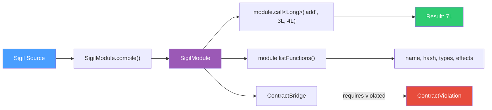

### SigilModule

The `SigilModule` class compiles Sigil source and exposes functions as callable Kotlin methods:

```kotlin
import sigil.interop.SigilModule

// Compile multiple functions at once
val math = SigilModule.compile("""
    fn abs(x: Int) -> Int { if x < 0 then -x else x }
    fn max(a: Int, b: Int) -> Int { if a > b then a else b }
    fn clamp(x: Int, lo: Int, hi: Int) -> Int {
        requires lo <= hi
        ensures result >= lo
        ensures result <= hi
        if x < lo then lo else if x > hi then hi else x
    }
""")

// Call functions
math.call<Long>("abs", -42L)           // 42L
math.call<Long>("max", 7L, 12L)        // 12L
math.call<Long>("clamp", 150L, 0L, 100L) // 100L

// Contract enforcement — requires lo <= hi
math.call<Long>("clamp", 50L, 100L, 0L)  // throws ContractViolation
```

### Contract Enforcement Modes

```kotlin
import sigil.interop.ContractBridge
import sigil.interop.EnforcementMode

// STRICT (default): throws ContractViolation
val strict = ContractBridge(EnforcementMode.STRICT)

// WARN: logs warning but continues
val warn = ContractBridge(EnforcementMode.WARN)

// MONITOR: records violation for metrics
val monitor = ContractBridge(EnforcementMode.MONITOR)
```

### Type Mappings

| Sigil Type | Kotlin Type | JVM Type |
|---|---|---|
| `Int` | `Long` | `long` |
| `Bool` | `Boolean` | `boolean` |
| `String` | `String` | `String` |
| `Float64` | `Double` | `double` |
| `Unit` | `Unit` | `void` |

---

## CLI

The `sigil` CLI provides commands for the full agent workflow:

```bash
# Compile a .sigil file to JVM bytecode
sigil compile math.sigil --output-dir ./out

# Compile and execute a function
sigil run math.sigil add 3 4
# Output: 7

# Verify without codegen (reports type, effect, contract status)
sigil verify math.sigil
# Output:
#   fn add(a: Int, b: Int) -> Int
#     Effects: pure
#     Contracts: none
#     Tier: 1 (TypeChecked)

# Inspect AST details with hashes
sigil inspect math.sigil

# Show help
sigil help
```

---

## Registry

The registry is Sigil's knowledge-sharing layer. When an agent publishes a verified function, it becomes discoverable by all other agents — searchable by type signature, effects, contracts, and intent.

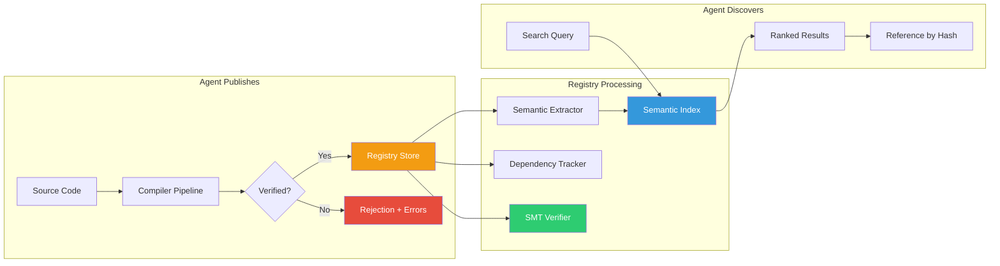

### Publishing

Submit source code to the registry. The full compiler pipeline runs automatically — type checking, effect checking, contract verification, hashing, semantic signature extraction, and dependency tracking.

```bash
# Publish via HTTP API
curl -X POST http://localhost:8080/registry/publish \
  -H "Content-Type: application/json" \
  -d '{
    "source": "fn abs(x: Int) -> Int { ensures result >= 0; if x < 0 then -x else x }",
    "metadata": {
      "aliases": ["absolute_value"],
      "intent": "returns the absolute value of an integer",
      "domain_tags": ["math", "numeric"]
    }
  }'
```

### Semantic Search

Search the registry by type signature, effects, contracts, domain tags, or free text. Results are ranked by relevance.

```bash
# Find all pure functions that take two Ints and return an Int
curl -X POST http://localhost:8080/registry/search \
  -H "Content-Type: application/json" \
  -d '{
    "inputTypes": ["#sigil:int", "#sigil:int"],
    "outputType": "#sigil:int",
    "effects": "pure"
  }'

# Search by contract guarantees
curl -X POST http://localhost:8080/registry/search \
  -d '{"ensuresContains": ["is_sorted"], "domainTags": ["sorting"]}'

# Search by intent (fuzzy text match on aliases and descriptions)
curl -X POST http://localhost:8080/registry/search \
  -d '{"textQuery": "absolute value"}'
```

### Dependency Tracking

The registry maintains a DAG of which functions reference which other functions. When a function is deprecated or found buggy, all downstream dependents are automatically flagged for re-verification.

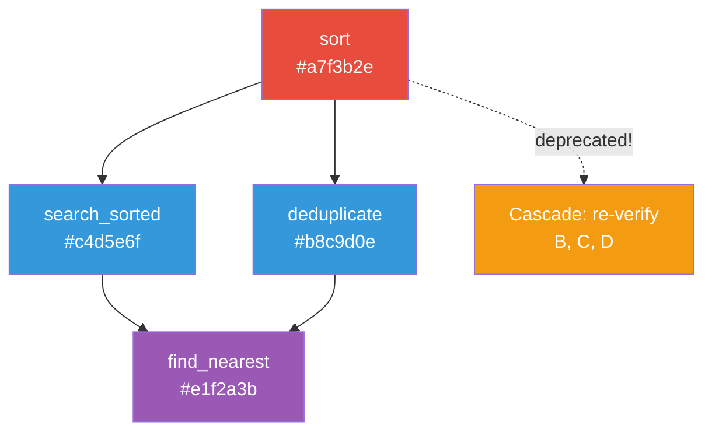

### SMT Verification (Tier 3)

The registry includes an SMT integration that can formally prove contract correctness. Contracts are translated to SMT-LIB2 format and verified with either the built-in simple solver or an external Z3 solver.

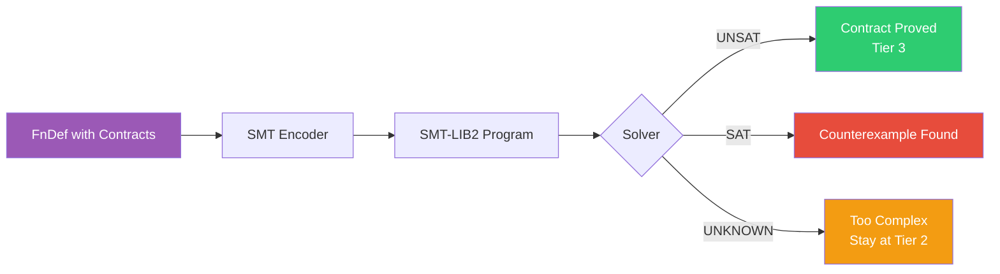

### HTTP API Reference

| Method | Endpoint | Description |
|---|---|---|
| `POST` | `/registry/publish` | Submit source code for verification and storage |
| `POST` | `/registry/search` | Search by type signature, effects, contracts, tags |
| `GET` | `/registry/node/{hash}` | Retrieve a node by its content hash |
| `GET` | `/registry/node/{hash}/dependents` | List all dependents of a node |
| `POST` | `/registry/node/{hash}/deprecate` | Deprecate a node and cascade to dependents |
| `GET` | `/registry/stats` | Registry statistics (counts by type and tier) |
| `GET` | `/health` | Health check |

---

## Dogfooding Examples

The `examples/` module demonstrates Sigil used in production-like backend scenarios, called from Kotlin via `SigilModule`.

### Math Utilities

```
fn abs(x: Int) -> Int { if x < 0 then -x else x }

fn clamp(x: Int, lo: Int, hi: Int) -> Int {
    requires lo <= hi
    ensures result >= lo
    ensures result <= hi
    if x < lo then lo else if x > hi then hi else x
}
```

### Validated Scoring

```
fn weighted_score(base: Int, bonus: Int, multiplier: Int) -> Int {
    requires multiplier > 0
    ensures result >= 0
    let raw = base * multiplier + bonus
    if raw < 0 then 0 else raw
}

fn normalize_score(score: Int, max_score: Int) -> Int {
    requires max_score > 0
    ensures result >= 0
    ensures result <= 100
    let pct = score * 100 / max_score
    if pct < 0 then 0 else if pct > 100 then 100 else pct
}
```

### Running the Demo

```bash
./gradlew :examples:run
```

```
=== Sigil Dogfooding Demo ===

abs(-42) = 42
clamp(150, 0, 100) = 100
max(7, 12) = 12
weighted_score(10, 5, 3) = 35
normalize_score(75, 200) = 37
Contract caught: safe_divide(10, 0) → Requires contract violated
```

---

## Performance

Benchmarks comparing Sigil-compiled JVM code against equivalent hand-written Kotlin:

| Benchmark | Sigil | Kotlin | Ratio |
|---|---|---|---|
| Simple arithmetic (add, square) | ~150ns | ~25ns | ~6x |
| Complex expressions | ~200ns | ~30ns | ~7x |
| Conditional logic | ~180ns | ~28ns | ~6x |

The overhead is primarily from reflection (`Method.invoke`) at the Kotlin boundary, not from codegen quality. The JIT-compiled Sigil bytecode itself is equivalent to Kotlin bytecode. Contract checking adds negligible overhead (~0-1%).

**Compilation throughput:** ~15-20K functions/sec (parse ~14us, hash ~10us, codegen ~4us).

**Blake3 hashing:** 116-259 MB/s depending on input size.

Run benchmarks with `./gradlew :compiler:test --tests "sigil.bench.*"`.

---

## AST Node Hierarchy

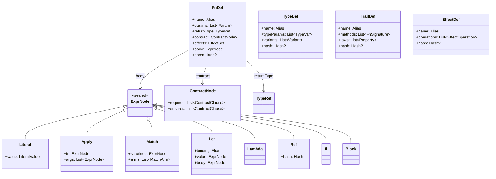

---

## Language Syntax

Sigil uses 15 keywords and a syntax inspired by Rust/Kotlin/ML:

```
fn  type  trait  effect  module  export  handler
let  match  if  then  else  requires  ensures  property
```

### Functions

```
fn add(a: Int, b: Int) -> Int { a + b }

fn max(a: Int, b: Int) -> Int {
  if a > b then a else b
}
```

### Algebraic Data Types

```
type State {
  | Idle
  | Processing(item: String)
  | Complete(result: String)
  | Failed(error: String)
}

type Pair<A, B> {
  | Pair(first: A, second: B)
}
```

### Pattern Matching

```
fn transition(state: State, event: Event) -> State {
  match (state, event) {
    (Idle, Start(item))        => Processing(item),
    (Processing(_), Finish(r)) => Complete(r),
    (Processing(_), Error(msg)) => Failed(msg),
    (Complete(_), Reset)       => Idle,
    (Failed(_), Reset)         => Idle,
    (s, _)                     => s
  }
}
```

### Effects

```
effect Http {
  get(url: String) -> String
  post(url: String, body: String) -> String
}

fn fetchData(url: String) -> String ! Http {
  Http.get(url)
}

handler MockHttp for Http {
  get = |url| "mock response"
  post = |url, body| "mock post"
}
```

### Traits

```
trait Monoid<T> {
  fn combine(a: T, b: T) -> T
  fn empty() -> T

  property forall (a: T) => combine(a, empty()) == a
  property forall (a: T) => combine(empty(), a) == a
}
```

---

## Type System

- **Structural typing** with **Hindley-Milner inference** — types are identified by structure, not name
- **Refinement types** — base types narrowed by predicates (`Refine Int where |self| self > 0`)
- **Trait-based polymorphism** — content-addressed trait definitions
- **Generic type parameters** with bounds (`T: Comparable`)

### Primitive Types

| Type | Hash Prefix | JVM Mapping |
|---|---|---|
| `Int` | `#sigil:int` | `long` |
| `Int32` | `#sigil:i32` | `int` |
| `Int64` | `#sigil:i64` | `long` |
| `Float64` | `#sigil:f64` | `double` |
| `Bool` | `#sigil:bool` | `boolean` |
| `String` | `#sigil:string` | `java.lang.String` |
| `Unit` | `#sigil:unit` | `void` |
| `List<T>` | `#sigil:list` | `java.util.List` |
| `Map<K, V>` | `#sigil:map` | `java.util.Map` |
| `Option<T>` | `#sigil:option` | nullable / sealed class |
| `Result<T, E>` | `#sigil:result` | sealed class |

---

## Getting Started

### Prerequisites

- **JDK 21+** (tested with OpenJDK 23)
- **Gradle** (wrapper included)

### Build

```bash
./gradlew build
```

### Run Tests

```bash
# All tests (compiler + registry + examples)
./gradlew test

# Individual modules
./gradlew :compiler:test
./gradlew :registry:test
./gradlew :examples:test
```

**262 tests** across 3 modules and 18 test suites:

#### Compiler (140 tests)

| Suite | Tests | Coverage |
|---|---|---|
| `TypeCheckerTest` | 29 | HM inference, pattern matching, generics, error cases |
| `ParserTest` | 24 | Lexer, all grammar constructs, spec examples |
| `InteropTest` | 15 | SigilModule, type mapping, contract bridge |
| `IntegrationTest` | 13 | Full end-to-end pipeline: parse, check, hash, compile, execute |
| `CliTest` | 13 | CLI commands: compile, run, verify, inspect, help |
| `JvmCodegenTest` | 9 | Bytecode generation, arithmetic, control flow, contracts |
| `ContractVerifierTest` | 9 | requires/ensures, contract chaining, severity levels |
| `Blake3Test` | 8 | Hash correctness, known test vectors, determinism |
| `BenchmarkTests` | 7 | Arithmetic, contract overhead, compilation, hashing benchmarks |
| `HasherTest` | 6 | Canonical serialization, name-independence, stability |
| `EffectCheckerTest` | 6 | Effect tracking, propagation, handler removal |

#### Registry (79 tests)

| Suite | Tests | Coverage |
|---|---|---|
| `RegistryStoreTest` | 16 | InMemoryStore CRUD, verification updates, dependency tracking |
| `SmtTest` | 16 | SMT-LIB2 encoding, contract verification, chaining, edge cases |
| `SemanticTest` | 13 | Signature extraction, type/effect/contract search, ranking |
| `DependencyTest` | 10 | Transitive deps, deprecation cascade, cycle detection |
| `ApiTest` | 9 | Ktor HTTP endpoints: publish, search, get, stats, errors |
| `IntegrationTest` | 15 | End-to-end: publish, search, compose, deprecate, SMT roundtrip |

#### Examples (43 tests)

| Suite | Tests | Coverage |
|---|---|---|
| `ExamplesTest` | 33 | Math, validators, scoring functions, contract violations, Sigil-vs-Kotlin comparison |
| `Phase3IntegrationTest` | 10 | Kotlin interop flow, agent workflow, dogfooding validation, performance sanity |

### Run the Registry Server

```bash
# Start with in-memory store (default)
./gradlew :registry:run

# Start with MongoDB
MONGO_URI=mongodb://localhost:27017 ./gradlew :registry:run

# Custom port
SIGIL_PORT=9090 ./gradlew :registry:run
```

### Use as a Library

```kotlin
import sigil.interop.SigilModule

// Simplest usage — compile and call
val module = SigilModule.compile("fn add(a: Int, b: Int) -> Int { a + b }")
val result = module.call<Long>("add", 3L, 4L)  // 7L
```

```kotlin
import sigil.api.SigilCompiler

// Lower-level — compile from AST
import sigil.ast.*

val fn = FnDef(
    name = "add",
    params = listOf(
        Param("a", TypeRef(PrimitiveTypes.INT)),
        Param("b", TypeRef(PrimitiveTypes.INT))
    ),
    returnType = TypeRef(PrimitiveTypes.INT),
    body = ExprNode.Apply(
        fn = ExprNode.Ref("#sigil:add"),
        args = listOf(ExprNode.Ref("a"), ExprNode.Ref("b"))
    )
)

val compiler = SigilCompiler()
val compiled = compiler.compileFn(fn)
println("Hash: ${compiled.hash}")
```

### Use the Registry Programmatically

```kotlin
import sigil.registry.api.*
import sigil.registry.store.InMemoryStore

val store = InMemoryStore()
val service = RegistryService(store)

// Publish a function
val responses = service.publish(PublishRequest(
    source = "fn double(x: Int) -> Int { x * 2 }",
    metadata = PublishMetadata(
        aliases = listOf("times_two"),
        intent = "doubles an integer",
        domainTags = listOf("math")
    )
))
println("Published: ${responses[0].hash}")

// Search for it
val results = service.search(SearchRequest(
    outputType = "#sigil:int",
    domainTags = listOf("math")
))
println("Found: ${results.size} results")
```

---

## Project Structure

```
sigil/
  build.gradle.kts                     # Root build (Kotlin 2.1.10, v0.3.0)
  settings.gradle.kts                  # Includes compiler, registry, examples

  compiler/                            # Phase 1: Compiler
    src/main/kotlin/sigil/
      ast/                             # AST node data classes (12 files)
        ExprNode.kt                    #   Expression nodes (sealed class, 8 variants)
        FnDef.kt                       #   Function definition
        TypeDef.kt                     #   Algebraic data types
        ContractNode.kt                #   requires/ensures contracts
        EffectDef.kt                   #   Effect declarations
        TraitDef.kt                    #   Trait definitions
        ModuleDef.kt                   #   Module definitions
        TypeRef.kt                     #   Type references & type variables
        RefinementType.kt              #   Refinement types
        EffectHandler.kt               #   Effect handler implementations
        Types.kt                       #   Primitive type constants
        Metadata.kt                    #   SemanticMeta, VerificationRecord
      hash/                            # Content-addressing
        Blake3.kt                      #   Pure Kotlin Blake3 implementation
        Hasher.kt                      #   Canonical AST serialization
      types/                           # Type system
        TypeChecker.kt                 #   Hindley-Milner type inference
        Unifier.kt                     #   Constraint unification (Algorithm W)
        TraitResolver.kt               #   Trait bound checking
      contracts/                       # Contract system
        ContractVerifier.kt            #   Contract validation + chaining
        PropertyTester.kt              #   Property-based testing (QuickCheck-style)
      effects/                         # Effect system
        EffectChecker.kt               #   Effect tracking + propagation
      codegen/jvm/                     # JVM backend
        JvmCodegen.kt                  #   ASM bytecode generation
        JvmLinker.kt                   #   ClassLoader for compiled code
        LocalVarTable.kt               #   Local variable index tracking
        ContractViolation.kt           #   Runtime exception for contract failures
      parser/                          # Text syntax
        SigilLexer.kt                  #   Tokenizer
        SigilParser.kt                 #   Recursive descent parser
      interop/                         # Phase 3: Kotlin interop
        SigilModule.kt                 #   Runtime container for compiled modules
        KotlinTypeMapper.kt            #   Sigil ↔ Kotlin type mappings
        ContractBridge.kt              #   Contract enforcement at boundary
      api/                             # Entry points
        SigilCompiler.kt               #   Unified compilation pipeline
        Cli.kt                         #   CLI command dispatcher
        Main.kt                        #   CLI entry point
    src/test/kotlin/sigil/             # 140 tests (+ benchmarks)

  registry/                            # Phase 2: Registry Infrastructure
    src/main/kotlin/sigil/registry/
      store/                           # Content-addressed storage
        RegistryStore.kt               #   Storage interface
        InMemoryStore.kt               #   HashMap-based (testing/dev)
        MongoStore.kt                  #   MongoDB backend (production)
        RegistryNode.kt                #   RegistryNode, NodeMetadata, SemanticSignature
      semantic/                        # Semantic indexing & search
        SemanticExtractor.kt           #   Extract signatures from AST nodes
        SemanticSearch.kt              #   SearchQuery, SearchResult, scoring engine
      deps/                            # Dependency tracking
        DependencyTracker.kt           #   DAG traversal, cascade deprecation
      smt/                             # SMT verification
        SmtEncoder.kt                  #   Contract → SMT-LIB2 translation
        SmtSolver.kt                   #   SimpleSmtSolver, Z3SmtSolver
      api/                             # HTTP API
        ApiModels.kt                   #   Request/response data classes
        RegistryService.kt             #   Business logic (orchestrates all components)
        RegistryRoutes.kt              #   Ktor route definitions
        Main.kt                        #   Server startup (Netty)
    src/test/kotlin/sigil/registry/    # 79 tests

  examples/                            # Phase 3: Dogfooding
    src/main/kotlin/sigil/examples/
      SigilPrograms.kt                 #   Sigil source (math, validators, scoring)
      Main.kt                          #   Demo application
    src/test/kotlin/sigil/             # 43 tests
      examples/ExamplesTest.kt         #   Function tests, contract violations
      Phase3IntegrationTest.kt         #   Cross-module integration tests
```

---

## Verification Tiers

Every compiled node receives a verification tier that represents the level of trust:

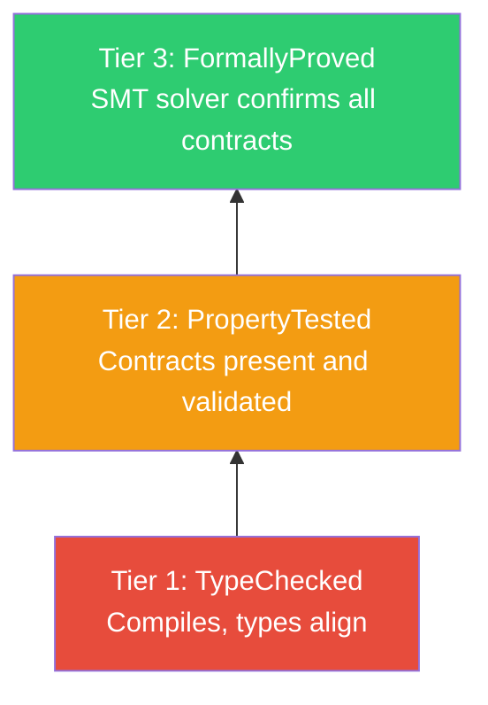

| Tier | Name | Requirement | Status |
|---|---|---|---|
| 1 | TypeChecked | Compiles, types align, effects verified | Implemented |
| 2 | PropertyTested | Contracts present and validated | Implemented |
| 3 | FormallyProved | SMT solver confirms all contracts | Implemented |

---

## Roadmap

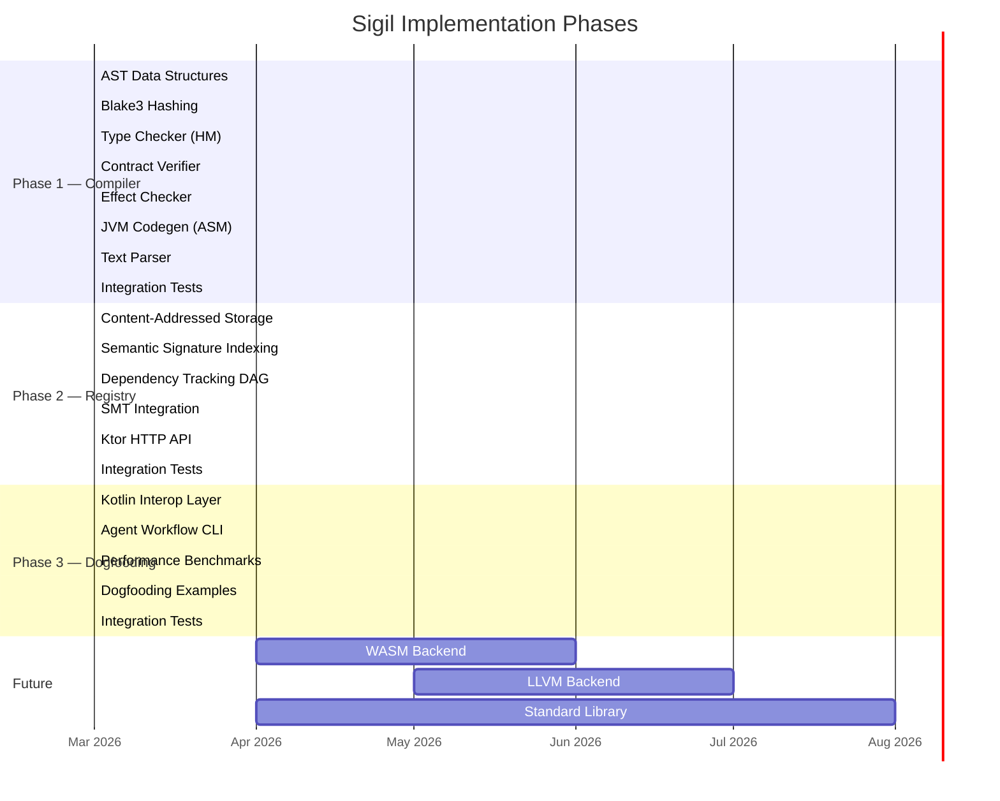

### What's Implemented

**Phase 1 — Compiler:**
- Full AST node type system with `@Serializable` annotations
- Pure Kotlin Blake3 implementation (256-bit, deterministic)
- Canonical AST serialization for content-addressing
- Hindley-Milner type inference (Algorithm W)
- Algebraic effect system with propagation
- Contract verification with chaining detection
- JVM bytecode generation (arithmetic, control flow, pattern matching, contracts)
- Recursive descent parser for the full text syntax
- Unified `SigilCompiler` pipeline API

**Phase 2 — Registry:**
- Content-addressed storage with InMemoryStore and MongoStore backends
- Semantic signature extraction from FnDef, TypeDef, and TraitDef
- Type-aware search with multi-factor scoring (type match, contracts, effects, tags, text)
- Dependency DAG with transitive traversal and cascade deprecation
- SMT-LIB2 encoder for contract-to-solver translation
- Built-in SimpleSmtSolver for basic arithmetic/boolean proofs
- Z3SmtSolver integration (shells out to z3 CLI with fallback)
- Contract chaining verification (proves composition safety)
- Ktor HTTP API with publish, search, get, deprecate, and stats endpoints
- CORS, content negotiation, and error handling middleware

**Phase 3 — Dogfooding:**
- Kotlin interop layer (`SigilModule`) for calling Sigil from Kotlin with one line
- Type-safe contract enforcement at the Kotlin boundary (STRICT/WARN/MONITOR modes)
- Bidirectional type mapping between Sigil and Kotlin/JVM types
- CLI with compile, run, verify, and inspect commands
- Performance benchmarks (arithmetic, contracts, compilation, hashing)
- Dogfooding examples: math utilities, validators, scoring computations
- End-to-end integration tests across compiler + registry + examples

### What's Planned

- **WASM Backend:** Edge functions, serverless, browser-based tooling
- **LLVM Backend:** Native performance-critical paths
- **Standard Library:** Core collection operations, string utilities, common patterns

---

## Design Principles

1. **AST-native, not text-native.** The canonical representation is a typed AST. Text is a rendering.
2. **Content-addressed identity.** Structure is identity. Names are aliases. No naming conflicts.
3. **Verification as a first-class layer.** Contracts are part of the hash. Unverified code cannot enter the registry.
4. **Effects are declared, not hidden.** Every side effect must be in the function signature.
5. **Target-agnostic persistence.** The verified AST is permanent. Compilation targets are pluggable.
6. **Agent-first ergonomics.** Designed for what agents need: structural clarity, unambiguous semantics, rich metadata.
7. **Knowledge compounds.** Every verified function published to the registry makes every future agent more capable.

---

## Contributing

Sigil is designed to be built *by* agents, *for* agents. The agent contribution protocol is:

1. Construct an AST node (as JSON or Kotlin objects) or write Sigil source text
2. Submit to the registry via HTTP API or programmatic `RegistryService`
3. The full compiler pipeline runs: parse, type check, effect check, contract verify
4. If all pass: Blake3 hash is computed, semantic signature extracted, dependencies tracked
5. The node is stored and becomes searchable by all agents
6. SMT solver runs for Tier 3 formal proof upgrade

---

## License

MIT
